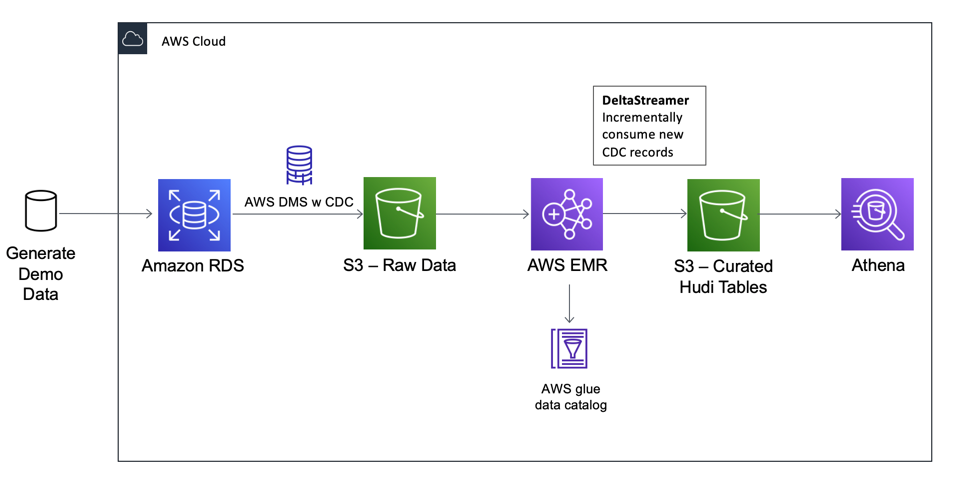

# Apache Hudi Demo Using AWS DMS CDC, EMR, and Glue Catalog

Demonstrate a simple Hudi data workflow in AWS using a mysql RDS as data source and S3 as storage for Hudi tables.
This project also showcase infrastructure as code patern by using Ansible to orchestrate the built and deployment of the components.

## Requirements

* AWS CLI
* Python 3.5+
* Ansible 2.9+
* [amazon.aws ansible](https://galaxy.ansible.com/amazon/aws) module collection:
    - `ansible-galaxy collection install amazon.aws`

User should already have EC2 key-pair generated and specified in environments main.yaml. Otherwise a new one will be created.
The key-pair it's used to access EMR.
## Architecture



[TBD]

## Project Structure

[TBD]


## Deployment

To deploy the project follow these steps:

1. Be sure you installed and configured all dependencies: AWS CLI, Python3.5+ and Ansible 2.9+. Have AWS CLI configured to point to your environment.
Also install ansible aws module collection: `ansible-galaxy collection install amazon.aws`


2. Define an environment specific to your case in `./ansible/environments/`  folder. You can duplicate `./ansible/environments/aia` to `./ansible/environments/prod` for example
Here is where you will set names, prefixes, instance classes etc.

3. Run ansible-playbook in ./ansible folder:

```bash

cd ./ansible
ansible-playbook main.yml -e "deployment_env=<your deployiment env>"

```


Before retracting the deployment, plese be sure the DMS replication task is stopped. Otherwise the retract will fail.
To retract all resources, run:

```bash

ansible-playbook retract.yml -e "deployment_env=<your deployiment env>"

```

## Using the Demo

